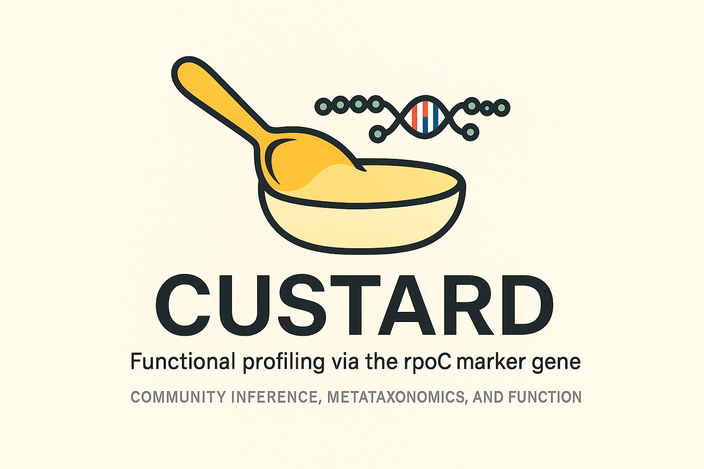

# 


🥄 CUSTARD - Community Unobserved States Translation using Annotations of rpoC Data

	- A framework for inferring microbial community functional capabilities using the rpoC marker gene

	CUSTARD is a reproducible Snakemake pipeline for processing paired‑end amplicon sequencing reads via the DADA2 workflow, customised to assign taxonomy using an `rpoC`‑based reference database. 
 This is the first module in a two‑stage system; future extensions will predict functional states from representative genome annotations.

---

## 📁 Directory Structure

```
custard/
├── Snakefile
├── config.yaml
├── scripts/
│   └── run_dada2.R
├── data/
│   └── fastq/                      # Place your raw FASTQ files here
└── db/
    └── rpoc_dada2_taxonomy.fa      # DADA2‑formatted rpoC taxonomy FASTA
```

---

## 🚀 Quick Start

### 1. Clone the repository
```bash
git clone https://your.repo.url/custard.git
cd custard
```

### 2. Install system dependencies

```bash
sudo apt update
sudo apt install -y     r-base build-essential libxml2-dev libcurl4-openssl-dev libssl-dev libfreetype6-dev libpng-dev libtiff5-dev libjpeg-dev zlib1g-dev libbz2-dev libharfbuzz-dev libfribidi-dev pkg-config
```

### 3. Create and activate Conda environment
```bash
conda create -n custard snakemake -c bioconda -c conda-forge
conda activate custard
```

### 4. Install R packages
```bash
Rscript -e '
if (!requireNamespace("BiocManager", quietly=TRUE))
  install.packages("BiocManager", repos="https://cloud.r-project.org");
BiocManager::install(c("dada2","Biostrings"), ask=FALSE)
'
```

---

## ⚙️ Configuration

Edit **config.yaml** to match your paths and resources:

```yaml
input_dir: "data/fastq"
output_dir: "results"
taxa_db: "db/rpoc_dada2_taxonomy.fa"
threads: 8
```

---

## ▶️ Running the Pipeline

1. **Prepare your FASTQ files**  
   Copy or symlink your paired `_R1.fastq.gz` and `_R2.fastq.gz` into `data/fastq/`.

2. **Provide the custom taxonomy file**  
   Ensure `db/rpoc_dada2_taxonomy.fa` contains your cleaned rpoC references in DADA2‑compatible format.

3. **Execute**  
   ```bash
   snakemake --cores 8
   ```

---

## 🧾 Outputs

All results appear under `results/`:

- **asv_table.tsv** — ASV abundance table (samples × ASVs)  
- **taxa_assignments.tsv** — Taxonomy for each ASV  
- **asv_sequences.fasta** — Representative ASV sequences  
- **seqtab.rds** — Raw sequence table (RDS format)  
- **taxa.rds** — Raw taxonomy object (RDS format)  

---

## 🔮 Next Steps (Part 2)

- Map ASVs to representative genomes via rpoC  
- Fetch precomputed eggNOG annotations per genome  
- Infer KO/COG functional profiles for each sample  

---

## 📄 License

Distributed for academic and research purposes. No warranty provided.

---

## ✉️ Contact

For questions or contributions, please contact the sgomathi@uwyo.edu.  

